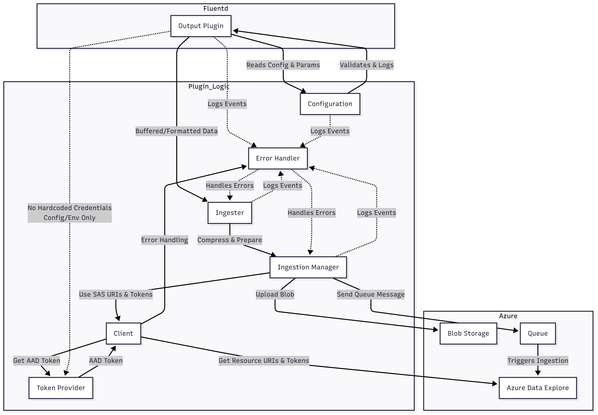

# fluent-plugin-kusto

[Fluentd](https://fluentd.org/) output plugin for ingesting logs and data into [Azure Data Explorer (Kusto)](https://azure.microsoft.com/en-us/services/data-explorer/).

## Overview

This plugin allows you to send data from Fluentd to Azure Data Explorer (Kusto) using Azure Blob Storage and Queue for scalable, reliable ingestion. It supports both buffered and non-buffered modes, handles authentication via Azure AD or Managed Identity, and provides robust error handling and logging.

## Requirements

- Ruby 2.5 or later  
  Check version (Windows/Linux):
  ```bash
  ruby --version
  ```
  Install on Ubuntu/Linux:
  ```bash
  sudo apt-get install ruby-full
  ```
  Install on Windows (using RubyInstaller):
  [Download RubyInstaller](https://rubyinstaller.org/)
  [Official Ruby installation guide](https://www.ruby-lang.org/en/documentation/installation/)

- Fluentd v1.0 or later  
  Check version (Windows/Linux):
  ```bash
  fluentd --version
  ```
  Install on Ubuntu/Linux:
  ```bash
  gem install fluentd
  ```
  Install on Windows (in Command Prompt after Ruby is installed):
  ```cmd
  gem install fluentd
  ```
  [Official Fluentd installation guide](https://docs.fluentd.org/installation)


## Installation

### RubyGems

```sh
$ gem install fluent-plugin-kusto --pre
```

### Bundler

Add the following line to your Gemfile:

```ruby
gem "fluent-plugin-kusto", "~> 0.0.1.beta"
```

**Note:** This is a beta release. Use the `--pre` flag with gem install or specify the beta version in your Gemfile.

And then execute:

```sh
$ bundle
```

## Azure Data Explorer (Kusto) Prerequisites
The _Kusto_ output plugin lets you ingest your logs into an [Azure Data Explorer](https://azure.microsoft.com/en-us/services/data-explorer/) cluster, using the [Queued Ingestion](https://docs.microsoft.com/en-us/azure/data-explorer/kusto/api/netfx/about-kusto-ingest#queued-ingestion) mechanism.

## Ingest into Azure Data Explorer: create a Kusto cluster and database

Create an Azure Data Explorer cluster in one of the following ways:

* [Create a free-tier cluster](https://dataexplorer.azure.com/freecluster)
* [Create a fully featured cluster](https://docs.microsoft.com/en-us/azure/data-explorer/create-cluster-database-portal)

## Create an Azure registered application

FluentD uses the Azure application's credentials to ingest data into your cluster.

* [Register an application](https://docs.microsoft.com/en-us/azure/active-directory/develop/quickstart-register-app#register-an-application)
* [Add a client secret](https://docs.microsoft.com/en-us/azure/active-directory/develop/quickstart-register-app#add-a-client-secret)
* [Authorize the app in your database](https://docs.microsoft.com/en-us/azure/data-explorer/kusto/management/access-control/principals-and-identity-providers#azure-ad-tenants)

## Create a Managed Identity in Azure

- **System-assigned Managed Identity:**
  - [Enable system-assigned managed identity](https://learn.microsoft.com/en-us/azure/active-directory/managed-identities-azure-resources/how-to-enable-system-assigned-managed-identity)

- **User-assigned Managed Identity:**
  - [Create and assign user-assigned managed identity](https://learn.microsoft.com/en-us/azure/active-directory/managed-identities-azure-resources/how-to-create-user-assigned-managed-identity)

- **Grant Permissions:**
  - [Assign permissions to managed identity for Azure Data Explorer](https://learn.microsoft.com/en-us/azure/data-explorer/kusto/management/access-control/principals-and-identity-providers)

## Workload Identity Authentication

- [Follow workload_identity.md](workload_identity.md)

## Create a database

To create a new database in your Azure Data Explorer cluster, use the following KQL command:

```kql
.create database <database_name>
```

## Create a table

Fluent Bit ingests the event data into Kusto in a JSON format. By default, the table includes 3 properties:

* `record` - the actual event payload.
* `tag` - the event tag.
* `timestamp` - the event timestamp.

A table with the expected schema must exist in order for data to be ingested properly.

```kql
.create table <table_name> (tag:string, timestamp:datetime, record:dynamic)
```

## Authentication Methods

This plugin supports four authentication methods for connecting to Azure Data Explorer:

### 1. Azure AD Application (aad)
Traditional client credentials flow using Azure AD app registration. Best for CI/CD pipelines and traditional applications.

**Required Parameters:**
- `auth_type`: `aad`
- `tenant_id`: Your Azure AD tenant ID
- `client_id`: The Azure AD application client ID
- `client_secret`: The Azure AD application client secret

### 2. System-Assigned Managed Identity (system_managed_identity)
Uses the system-assigned managed identity of Azure resources (VMs, App Services, AKS nodes). No secrets to manage.

**Required Parameters:**
- `auth_type`: `system_managed_identity`
- `managed_identity_client_id`: Set to `SYSTEM`

### 3. User-Assigned Managed Identity (user_managed_identity)
Uses a user-assigned managed identity. Allows sharing the same identity across multiple Azure resources.

**Required Parameters:**
- `auth_type`: `user_managed_identity`
- `managed_identity_client_id`: The client ID (GUID) of the user-assigned managed identity

### 4. Azure Workload Identity (workload_identity)
Modern approach for Kubernetes/AKS workloads. Replaces the legacy Pod Identity system using OIDC federation.

**Required Parameters:**
- `auth_type`: `workload_identity`
- `workload_identity_client_id`: The client ID for workload identity
- `workload_identity_tenant_id`: The tenant ID for workload identity
- `workload_identity_token_file_path`: Path to the workload identity token file (optional, defaults to `/var/run/secrets/azure/tokens/azure-identity-token`)

## Data Schema and Ingestion Mapping

### Fixed 3-Column Schema
The plugin uses a standardized 3-column schema for all ingested data:

| Column | Type | Description |
|--------|------|-------------|
| `tag` | string | The Fluentd event tag |
| `timestamp` | datetime | The event timestamp |
| `record` | dynamic | The actual event payload as JSON |

### Ingestion Mapping Support
You can now use pre-defined ingestion mappings in Kusto to transform data during ingestion by setting the `ingestion_mapping_reference` parameter. This allows you to:

- Transform the default 3-column format into your desired schema
- Apply data transformations during ingestion for better performance
- Use Kusto's native ingestion mapping capabilities

**Example:**
```conf
<match test.kusto>
  @type kusto
  # ... other configuration ...
  ingestion_mapping_reference my_custom_mapping
</match>
```

Then create the mapping in Kusto:
```kql
.create table MyTable ingestion json mapping "my_custom_mapping" 
@'[
  {"column":"EventTime", "path":"$.timestamp", "datatype":"datetime"},
  {"column":"Source", "path":"$.tag", "datatype":"string"},
  {"column":"Level", "path":"$.record.level", "datatype":"string"},
  {"column":"Message", "path":"$.record.message", "datatype":"string"}
]'
```

### Alternative Pattern: Landing Table + Update Policy

If you prefer not to use ingestion mappings, you can still use this pattern for schema transformation:

```kql
-- 1. Create landing table (matches plugin output)
.create table RawLogs (tag:string, timestamp:datetime, record:dynamic)

-- 2. Create your target table with desired schema
.create table ProcessedLogs (
    EventTime: datetime,
    Source: string,
    Level: string,
    Message: string,
    UserId: string,
    Properties: dynamic
)

-- 3. Create update policy to transform data
.alter table ProcessedLogs policy update
@'[{
    "IsEnabled": true,
    "Source": "RawLogs",
    "Query": "RawLogs | extend EventTime=timestamp, Source=tag, Level=tostring(record.level), Message=tostring(record.message), UserId=tostring(record.userId), Properties=record.properties | project EventTime, Source, Level, Message, UserId, Properties",
    "IsTransactional": true,
    "PropagateIngestionProperties": false
}]'
```

This approach provides flexibility to transform the generic 3-column format into any schema you need.

## Configuration Parameters

| Key | Description | Default |
| --- | ----------- | ------- |
| `auth_type` | Authentication method: `aad`, `system_managed_identity`, `user_managed_identity`, `workload_identity` | `aad` |
| `tenant_id` | Azure AD tenant ID. Required for `aad` authentication. | _none_ |
| `client_id` | Azure AD application client ID. Required for `aad` authentication. | _none_ |
| `client_secret` | Azure AD application client secret. Required for `aad` authentication. | _none_ |
| `managed_identity_client_id` | For managed identity: `SYSTEM` for system-assigned, or client ID (GUID) for user-assigned. | _none_ |
| `workload_identity_client_id` | Client ID for workload identity authentication. | _none_ |
| `workload_identity_tenant_id` | Tenant ID for workload identity authentication. | _none_ |
| `workload_identity_token_file_path` | Path to workload identity token file. | `/var/run/secrets/azure/tokens/azure-identity-token` |
| `endpoint` | Kusto cluster endpoint (e.g., `https://cluster.region.kusto.windows.net`) | _none_ |
| `database_name` | Target database name. | _none_ |
| `table_name` | Target table name. | _none_ |
| `compression_enabled` | Enable gzip compression for HTTP payload. | `true` |
| `buffered` | Enable disk buffering before ingestion. | `true` |
| `delayed` | Enable delayed commit for buffer chunks (requires `buffered: true`). | `false` |
| `deferred_commit_timeout` | Max time (seconds) to wait for deferred commit verification. | `30` |
| `ingestion_mapping_reference` | Name of a pre-defined ingestion mapping in Kusto for data transformation during ingestion. | _none_ |
| `azure_cloud` | Azure cloud environment: `AzureCloud`, `AzureChinaCloud`, `AzureUSGovernmentCloud`, `AzureGermanCloud` | `AzureCloud` |
| `logger_path` | File path for plugin logs. If not set, logs to stdout. | stdout |

### Buffer Configuration (buffered mode only)
| Key | Description | Default |
| --- | ----------- | ------- |
| `chunk_keys` | Buffer chunking keys: `tag`, `time`, or `["tag", "time"]` | `["time"]` |
| `timekey` | Time interval for buffer chunking (seconds) | `86400` (1 day) |
| `timekey_wait` | Wait time before flushing timekey chunk | `30s` |
| `timekey_use_utc` | Use UTC for timekey chunking | `true` |
| `flush_at_shutdown` | Flush buffer at shutdown | `true` |
| `retry_max_times` | Maximum retry attempts for buffer flush | `5` |
| `retry_wait` | Wait time between retries | `1s` |
| `overflow_action` | Action on buffer overflow: `block`, `drop_oldest_chunk`, `throw_exception` | `block` |
| `chunk_limit_size` | Maximum size per buffer chunk | `256m` |
| `total_limit_size` | Maximum total buffer size | `2g` |
| `flush_mode` | Buffer flush mode: `interval`, `immediate`, `lazy` | `interval` |
| `flush_interval` | Buffer flush interval | `10s` |

## Sample Configurations

### 1. Azure AD Authentication
```conf
<match test.kusto>
  @type kusto
  @log_level debug
  
  # Authentication - Azure AD
  auth_type aad
  tenant_id 12345678-1234-1234-1234-123456789abc
  client_id 87654321-4321-4321-4321-abcdef123456
  client_secret your-app-secret-here
  
  # Kusto connection
  endpoint https://mycluster.eastus.kusto.windows.net
  database_name MyDatabase
  table_name MyLogs
  
  # Optional settings
  azure_cloud AzureCloud
  compression_enabled true
  buffered true
  delayed false
  
  <buffer>
    @type memory
    timekey 1m
    timekey_wait 30s
    flush_interval 10s
  </buffer>
</match>
```

### 2. System-Assigned Managed Identity
```conf
<match test.kusto>
  @type kusto
  @log_level debug
  
  # Authentication - System Managed Identity
  auth_type system_managed_identity
  managed_identity_client_id SYSTEM
  
  # Kusto connection
  endpoint https://mycluster.eastus.kusto.windows.net
  database_name MyDatabase
  table_name MyLogs
  
  # Optional settings
  azure_cloud AzureCloud
  compression_enabled true
  buffered true
  delayed false
  
  <buffer>
    @type memory
    timekey 1m
    timekey_wait 30s
    flush_interval 10s
  </buffer>
</match>
```

### 3. User-Assigned Managed Identity
```conf
<match test.kusto>
  @type kusto
  @log_level debug
  
  # Authentication - User Managed Identity
  auth_type user_managed_identity
  managed_identity_client_id 11111111-2222-3333-4444-555555555555
  
  # Kusto connection
  endpoint https://mycluster.eastus.kusto.windows.net
  database_name MyDatabase
  table_name MyLogs
  
  # Optional settings
  azure_cloud AzureCloud
  compression_enabled true
  buffered true
  delayed false
  
  <buffer>
    @type memory
    timekey 1m
    timekey_wait 30s
    flush_interval 10s
  </buffer>
</match>
```

### 4. Azure Workload Identity (Kubernetes/AKS)
```conf
<match test.kusto>
  @type kusto
  @log_level debug
  
  # Authentication - Workload Identity
  auth_type workload_identity
  workload_identity_client_id 99999999-8888-7777-6666-555555555555
  workload_identity_tenant_id 12345678-1234-1234-1234-123456789abc
  workload_identity_token_file_path /var/run/secrets/azure/tokens/azure-identity-token
  
  # Kusto connection
  endpoint https://mycluster.eastus.kusto.windows.net
  database_name MyDatabase
  table_name MyLogs
  
  # Optional settings
  azure_cloud AzureCloud
  compression_enabled true
  buffered true
  delayed false
  
  <buffer>
    @type memory
    timekey 1m
    timekey_wait 30s
    flush_interval 10s
  </buffer>
</match>
```

# Fluentd Azure Data Explorer (Kusto) Output Plugin Architecture


This diagram shows the main components and data flow for the plugin, including configuration, error handling, token management, and Azure resource interactions.

## Copyright

* License: Apache License, Version 2.0
